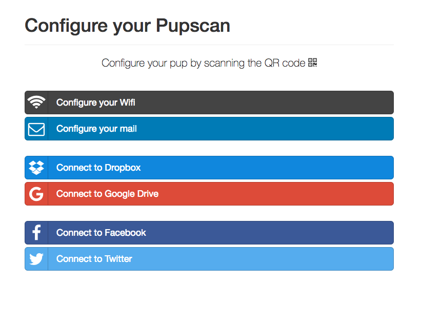

# Pupscan configuration application

## How to

* `yarn install`
* `yarn start`
* Go to http://localhost:8080/
* to use external services you should set variable environment
    - DROPBOX_CLIENT_ID
    - GOOGLE_CLIENT_ID
    - GOOGLE_CLIENT_SECRET

For now only dropbox it's working.

## Configure your IntelliJ

* Set the JavaScript version: **Preference > Language & Framework > JavaScript**, select `ECMAScript 6`
* Remove semicolon: **Preference > Editor > Code Style > JavaScript > Punctuation**, select `Don't use`
* Install mustache plugins
